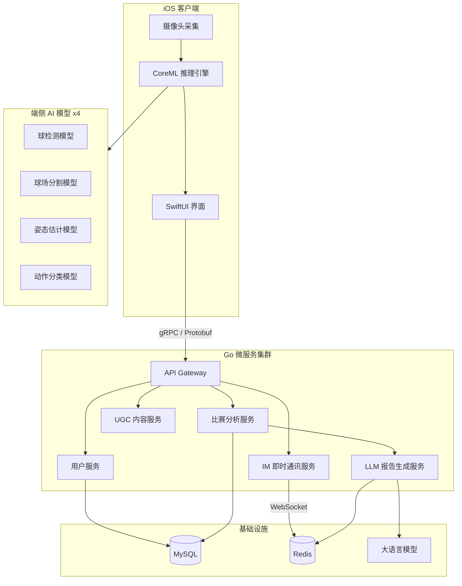

# 体育赛事 AI 智能分析平台（网球）

> 本仓库仅用于项目展示，不包含源代码。

## 项目概览

一个面向网球运动的 AI 智能分析平台，集成端侧实时推理、3D 轨迹重建、智能报告生成和社交互动功能。采用 iOS 原生客户端 + Go 微服务架构，覆盖从视频采集到 AI 分析的完整链路。

**角色：** 技术架构负责人 · iOS + Go 全栈开发

**周期：** 2025.03 - 2026.01

## 系统架构

## 核心技术亮点

### 1. 端侧 AI 实时推理

部署 4 个 CoreML 模型到 iOS 设备端，实现离线实时视频分析：

| 模型 | 功能 | 说明 |
|------|------|------|
| 球检测 | 定位网球位置 | 逐帧检测网球坐标 |
| 球场分割 | 识别球场区域 | 语义分割球场边界线 |
| 姿态估计 | 人体骨骼提取 | 17 关键点实时追踪 |
| 动作分类 | 击球动作识别 | 正手/反手/发球/截击 |

### 2. 3D 轨迹重建引擎

自研算法从 2D 视频还原网球 3D 飞行轨迹：
- 基于球场几何约束的单目深度估计
- 贝塞尔曲线拟合飞行轨迹
- 精确计算落点坐标和球速

### 3. 微服务架构设计

基于 Go + Kratos 框架构建，采用 Proto-First 开发模式：
- **74 个 API** 接口设计，gRPC + HTTP 双协议支持
- **Proto-First** 跨端契约管理，iOS / Web / 后端共用一套 Proto 定义
- **WebSocket 实时 IM** 系统：好友、群组、VoIP 语音通话
- **UGC 内容审核** 模块：文本/图片内容安全检测
- **用户安全管理** 与多级资源鉴权体系

### 4. AI 智能分析报告

后端接入大语言模型，根据比赛数据自动生成：
- 技术动作分析（击球质量、稳定性评估）
- 战术建议（基于对手弱点的策略推荐）
- 训练计划生成
- Redis 缓存优化，避免重复调用 LLM

### 5. AI 辅助开发治理体系

设计并推行团队级 AI 工程化框架：
- 前后端统一接入 AI 辅助开发工具链
- 制定 AI 生成代码审查规范
- 提升整体研发效率和代码质量

## 技术栈

**客户端：** Swift · CoreML · SwiftUI · SPM

**后端：** Go · Kratos · gRPC · Protobuf · MySQL · Redis

**AI：** CoreML · LLM API

**工程化：** Proto-First · CI/CD · 质量管理流水线
