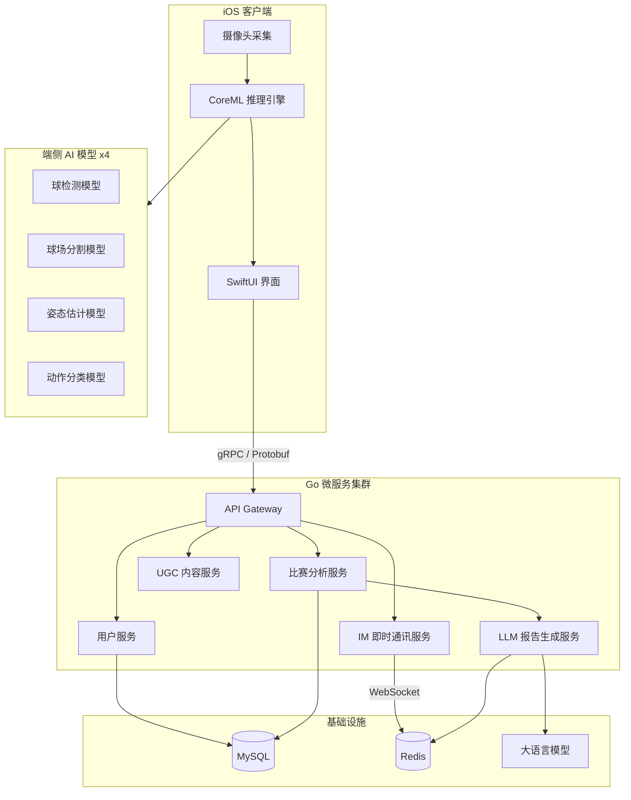
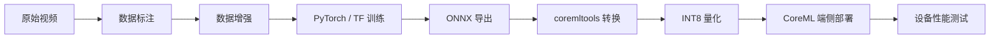

# 体育赛事 AI 智能分析平台（网球）

> 本仓库仅用于项目展示，不包含源代码。

## 版本说明

- `Showcase 类型`: 面向面试和技术交流的脱敏版本
- `代码状态`: 生产代码在组织私有仓库持续迭代
- `最近整理`: 2026-03（补充训练流程、技术取舍、关键指标）
- `可对外信息`: 架构、方案、指标区间、工程经验
- `不公开内容`: 业务数据、私有模型权重、内部实现细节

## 项目概览

一个面向网球运动的 AI 智能分析平台，集成端侧实时推理、3D 轨迹重建、智能报告生成和社交互动功能。采用 iOS 原生客户端 + Go 微服务架构，覆盖从视频采集到 AI 分析的完整链路。

**角色：** 技术架构负责人 · iOS + Go 全栈开发

**周期：** 2025.03 - 2026.01

## 最近更新（面试可讲）

- 增补了端侧模型训练和 CoreML 部署路径（训练 -> 导出 -> 转换 -> 量化 -> Benchmark）
- 明确了端侧推理与云端推理的取舍逻辑（时延、隐私、网络稳定性）
- 增补了 3D 轨迹重建关键步骤（标定、深度估计、轨迹拟合、落点计算）
- 补充了工程化细节（Proto-First、74 API 分域、RBAC + 资源鉴权）

## 效果展示

<!-- 截图占位，后续替换为实际截图 -->

| 视频分析界面 | 3D 轨迹重建 | AI 分析报告 |
|:---:|:---:|:---:|
|  |  |  |

> 以上为占位图，实际截图待补充。

## 系统架构

## 端侧模型训练与部署

### 模型概览

| 模型 | 任务 | 基础网络 | 训练框架 | 数据集 |
|------|------|----------|----------|--------|
| 球检测 | 目标检测 | YOLOv8-nano | PyTorch / Ultralytics | 公开网球数据集 + 自采集标注 |
| 球场分割 | 语义分割 | DeepLabV3-MobileNet | PyTorch | 自标注球场线数据 |
| 姿态估计 | 关键点检测 | MoveNet-Lightning | TensorFlow | COCO Keypoints + 网球场景微调 |
| 动作分类 | 时序分类 | 轻量 CNN + LSTM | PyTorch | 自采集击球片段标注 |

### 训练流程

### 数据准备

- **球检测：** 基于公开的网球比赛视频数据集（约 8k 帧标注），补充自采集训练场景约 3k 帧，使用 CVAT 标注工具
- **球场分割：** 自采集不同光照、角度的球场图片约 2k 张，标注球场线和边界
- **姿态估计：** 基于 COCO Keypoints 预训练权重，使用约 5k 帧网球场景数据微调
- **动作分类：** 自采集并标注约 4 类击球动作（正手/反手/发球/截击）各约 500 段视频片段
- **数据增强：** 随机裁剪、色彩抖动、水平翻转、模拟运动模糊（针对高速球场景）

### 端侧优化策略

- **模型量化：** 训练后通过 coremltools 进行 INT8 量化，模型体积缩小约 4x，推理速度提升约 2x，精度损失控制在 1-2% 以内
- **模型选型策略：** 优先选择 MobileNet / Nano 级轻量网络作为 backbone，在端侧精度和速度之间取平衡
- **推理管线：** 4 个模型非同时运行——球检测 + 球场分割逐帧执行，姿态估计降帧至 15fps，动作分类在检测到击球事件后触发，避免 GPU 资源争抢
- **设备测试：** iPhone 14 Pro 上单帧推理延迟 < 30ms（球检测），整体管线保持 25-30fps 流畅分析

### 踩过的坑

- **小目标检测难题：** 网球在视频中像素很小（远景时仅 5-10px），标准 YOLOv8 漏检严重。解决方案：增加小目标锚框、训练时对小目标区域做 Mosaic 增强、推理时对感兴趣区域做 2x 放大裁剪
- **CoreML 转换兼容性：** 部分 PyTorch 算子（如 `grid_sample`）coremltools 不支持，需要手动拆解为等价操作或使用 ONNX 中转
- **量化精度回退：** 动作分类模型 INT8 量化后准确率下降约 5%，最终该模型保留 FP16 精度，其余三个模型使用 INT8

## 核心技术亮点

### 1. 3D 轨迹重建引擎

自研算法从单目 2D 视频还原网球 3D 飞行轨迹，这是整个项目技术难度最高的模块：

- **球场标定：** 通过球场分割模型检测场地线，结合标准网球场尺寸（23.77m x 10.97m）计算单应性矩阵，建立像素坐标到真实世界坐标的映射
- **深度估计：** 利用球在画面中的大小变化和球场几何约束，估算球的三维位置
- **轨迹拟合：** 使用带物理约束的贝塞尔曲线拟合飞行轨迹（考虑重力加速度和空气阻力），平滑处理检测帧间的跳变
- **落点计算：** 根据拟合轨迹与球场平面的交点确定落点坐标，误差控制在 30cm 以内

**技术难点：** 单目视频缺乏深度信息，需要依赖球场几何作为先验约束。不同拍摄角度、镜头焦距都会影响标定精度。最终通过要求用户在固定机位拍摄 + 自动校准算法的方式平衡了易用性和精度。

### 2. 微服务架构设计

基于 Go + Kratos 框架构建，采用 Proto-First 开发模式：

- **74 个 API** 按业务域拆分为 6 个微服务，每个服务独立 Proto 定义
- **Proto-First** 跨端契约管理：先写 Proto 文件 → 自动生成 Go server / Swift client / 接口文档，确保前后端类型一致
- **WebSocket 实时 IM** 系统：好友、群组、VoIP 语音通话
- **UGC 内容审核** 模块：接入第三方内容安全 API，文本/图片异步审核
- **多级资源鉴权：** RBAC 权限模型 + 资源粒度访问控制

### 3. AI 智能分析报告

后端接入 LLM 根据比赛数据自动生成分析报告：

- 技术动作分析（击球质量、稳定性评估）
- 战术建议（基于对手弱点的策略推荐）
- 训练计划生成
- Redis 缓存相同比赛的分析结果，避免重复调用 LLM，命中率约 60%

## 技术决策与取舍

### 为什么选 Kratos 而不是 go-zero / go-micro？

| 维度 | Kratos | go-zero | 选择理由 |
|------|--------|---------|----------|
| Proto-First | 原生支持，CLI 一键生成 | 支持但不是核心设计 | 我们需要前后端共享 Proto 定义 |
| 架构理念 | 类似 DDD 分层，关注点分离 | 偏向快速 CRUD | 项目业务较复杂，需要清晰分层 |
| 可插拔中间件 | Transport 层抽象好，gRPC/HTTP 统一处理 | HTTP 和 RPC 分开定义 | 需要同时暴露 gRPC（iOS）和 HTTP（管理后台） |
| 社区 & 维护 | B 站开源，文档完善 | 好未来开源 | 两者社区都活跃，Kratos 的 Proto-First 工作流更契合需求 |

### 为什么选端侧推理而不是云端推理？

- **实时性要求：** 网球比赛节奏快，云端推理的网络延迟（100-300ms）无法满足逐帧分析需求
- **离线场景：** 网球场往往在户外，网络信号不稳定，端侧推理不依赖网络
- **隐私考虑：** 用户视频不上传服务器，减少隐私顾虑
- **代价：** 模型必须做轻量化，精度相比云端大模型有所牺牲，通过后处理逻辑弥补

## 技术栈

**客户端：** Swift · CoreML · SwiftUI · SPM · Vision Framework

**后端：** Go · Kratos · gRPC · Protobuf · MySQL · Redis

**AI 训练：** PyTorch · TensorFlow · Ultralytics · coremltools · CVAT

**工程化：** Proto-First · GitHub Actions CI/CD · 质量管理流水线
