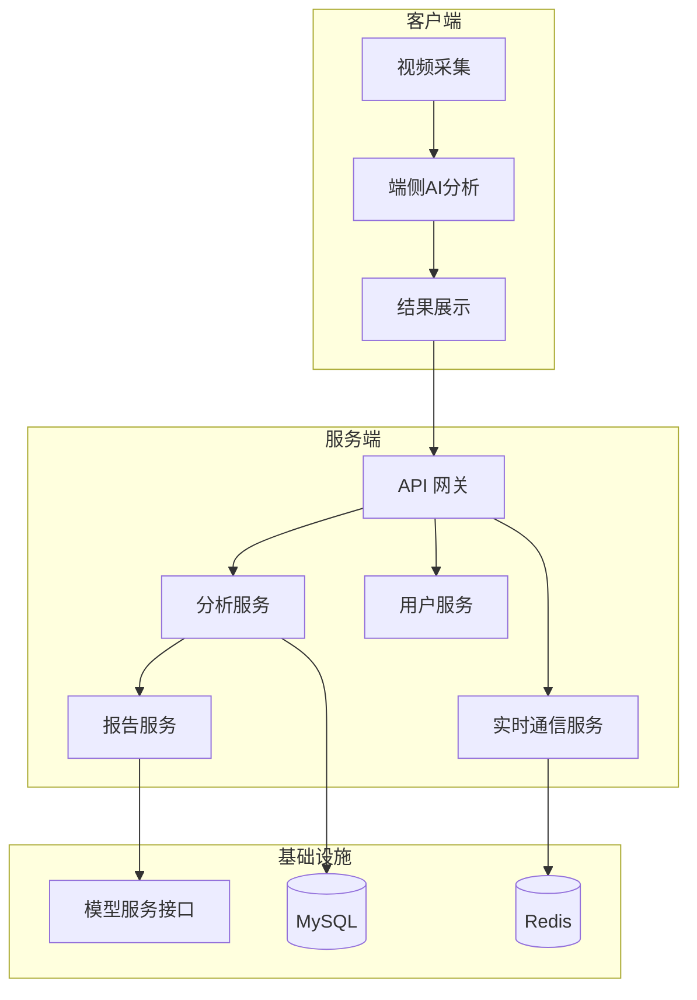

# 体育赛事 AI 智能分析平台（网球）

> 本仓库仅用于项目展示，不包含源代码。

## 版本说明

- `Showcase 类型`: 面向面试和技术交流的脱敏版本
- `代码状态`: 生产代码在组织私有仓库持续迭代
- `最近整理`: 2026-03（精简为可公开信息）
- `可对外信息`: 架构分层、工程实践、交付结果
- `不公开内容`: 核心算法细节、模型训练参数、业务数据与内部策略

## 项目概览

面向网球场景的 AI 智能分析平台，提供端侧实时分析、后端数据处理与报告生成能力，覆盖从视频采集到分析输出的完整链路。

**角色：** 技术架构负责人 · iOS + Go 全栈开发  
**周期：** 2024.12 - 2026.01

## 核心职责与贡献（公开版）

- 主导端侧 AI 能力接入与性能优化，保障实时分析体验
- 负责后端微服务架构与接口规范，支撑多端协作开发
- 设计并落地比赛分析报告链路，提升数据可读性与可用性
- 搭建实时通信与内容安全流程，完善平台基础能力
- 推动工程化治理与质量管理，提升交付效率与稳定性

## 架构概览（脱敏）

## 技术栈

**客户端：** Swift · CoreML · SwiftUI  
**后端：** Go · Kratos · gRPC · Protobuf · MySQL · Redis  
**工程化：** Proto-First · CI/CD · 质量管理流水线

## 说明

本仓库用于展示项目方法论与工程能力，不代表生产仓库的完整技术实现。面试交流可展开架构设计、技术取舍与项目管理实践。
